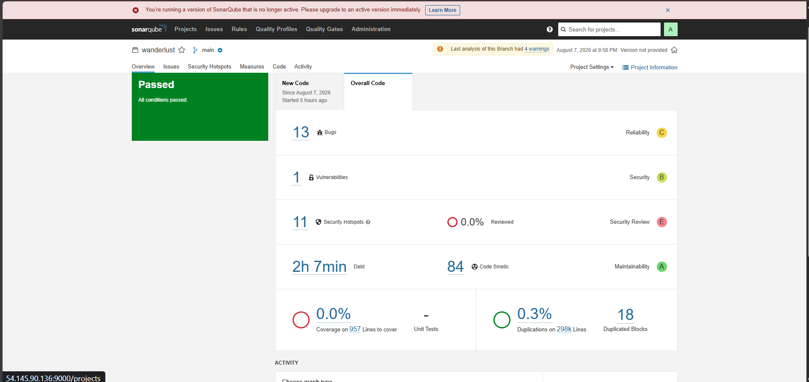
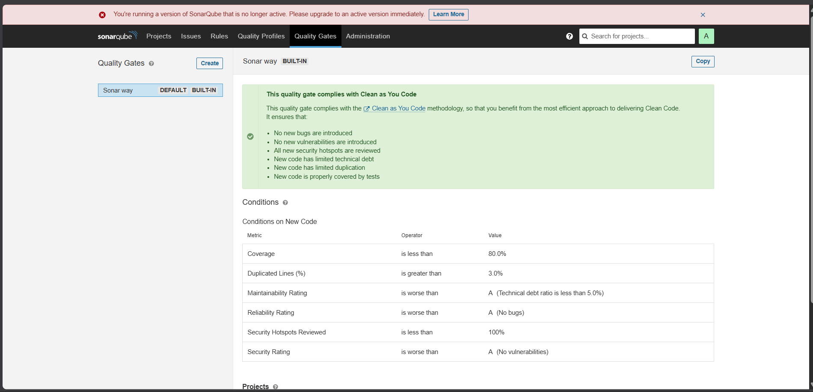
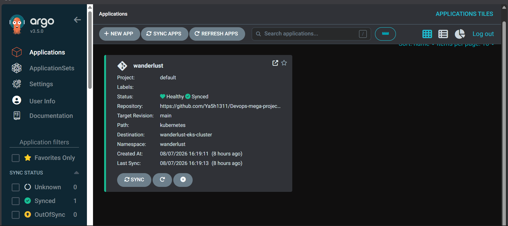
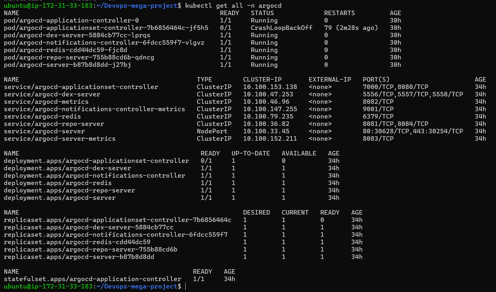
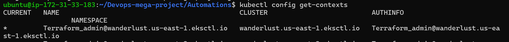
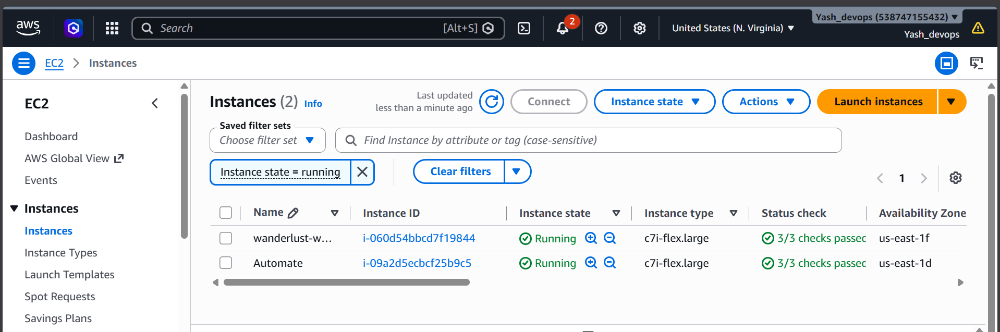

# Wanderlust - Your Ultimate Travel Blog 🌍✈️

# 🚀 End-to-End DevOps Implementation for a MERN Stack Application on AWS


#

## 📖 Overview

This project demonstrates the complete DevOps lifecycle by automating the build, security scanning, testing, containerization, deployment, and monitoring of a production-style MERN Stack application on AWS.

The entire workflow follows modern DevOps practices, beginning with source code management in GitHub and ending with automated deployments to Amazon EKS using GitOps principles through ArgoCD.

The project emphasizes Infrastructure as Code, CI/CD automation, DevSecOps, Kubernetes orchestration, container security, and observability.

### <mark>Project Deployment Flow:</mark>


## ✨ Key Highlights

- GitHub (Code)
- Infrastructure provisioning using Terraform
- AWS EC2 and Amazon EKS deployment
- Complete CI/CD pipeline with Jenkins
- Shared Jenkins Libraries
- SonarQube Static Code Analysis
- OWASP Dependency Check
- Trivy Filesystem & Container Image Scanning
- Docker Image Build & Push
- GitOps deployment using ArgoCD
- Kubernetes deployment with Helm
- Prometheus & Grafana Monitoring
- Automated Environment Configuration
- Integrated automatic email notification on success or failure of pipeline


### How pipeline will look after deployment:
- <b>CI pipeline to build and push</b>


- <b>CD pipeline to update application version</b>


- <b>ArgoCD application for deployment on EKS</b>


# Architecture
```text
GitHub
   │
   ▼
Jenkins CI
   │
   ├── Trivy FS Scan
   ├── OWASP Dependency Check
   ├── SonarQube Analysis
   ├── Docker Build
   ├── Trivy Image Scan
   └── Docker Push
        │
        ▼
GitOps Repository
        │
        ▼
ArgoCD
        │
        ▼
Amazon EKS
        │
        ▼
Prometheus + Grafana
```
# Technology Stack
Category	        Technologies
Cloud           	AWS EC2, Amazon EKS
IaC             	Terraform
SCM	              Git, GitHub
CI/CD	            Jenkins
Containers       	Docker
Orchestration	    Kubernetes
GitOps	          ArgoCD
Security	        Trivy, OWASP Dependency Check
Mail              Gmail 
Code Quality	    SonarQube
Monitoring      	Prometheus, Grafana
Registry	        Docker Hub
Application     	MERN Stack

```text
# CI/CD Workflow
Developer
      │
      ▼
GitHub Repository
      │
      ▼
Jenkins Pipeline
      │
      ├── Source Checkout
      ├── Dependency Installation
      ├── Trivy Filesystem Scan
      ├── OWASP Dependency Check
      ├── SonarQube Analysis
      ├── Quality Gate
      ├── Docker Image Build
      ├── Trivy Image Scan
      ├── Docker Push
      └── Update GitOps Repository
                    │
                    ▼
               ArgoCD Sync
                    │
                    ▼
               Amazon EKS
                    │
                    ▼
      Prometheus + Grafana Monitoring
```
## 📚 What I Learned

- Designing production-style CI/CD pipelines
- Managing Kubernetes deployments using GitOps
- Automating cloud infrastructure provisioning
- Integrating security into the CI pipeline
- Implementing monitoring and alerting
- Managing Docker images and registries
- Troubleshooting Jenkins pipelines and Kubernetes deployments

## 🔐 Security & Code Quality
### 🔍 SonarQube Code Quality Analysis


### ✅ SonarQube Quality Gate Passed



## ☸️ Kubernetes & GitOps
### 🔄 ArgoCD GitOps Deployment Status


### ☸️ Kubernetes Pods Running Successfully &  🌐 Kubernetes Services & Networking


### ☁️ Amazon EKS Cluster Nodes



## 📊 Monitoring & Observability

### 📊 Grafana Monitoring & Observability Dashboard


## ☁️ Infrastructure
### ☁️ AWS Cloud Infrastructure


## 🚀 Application
### 🚀 Application Successfully Deployed


